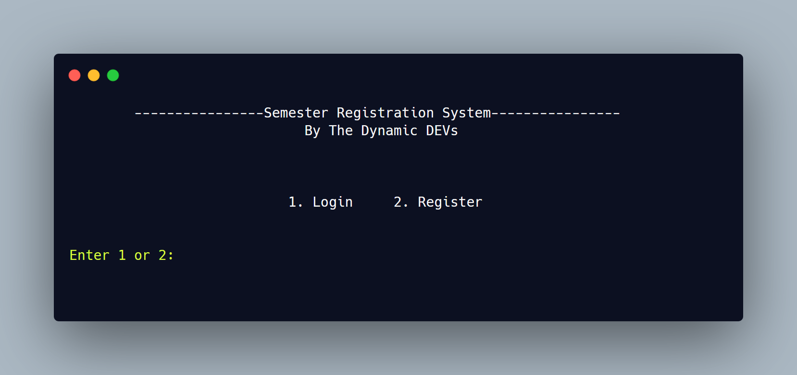
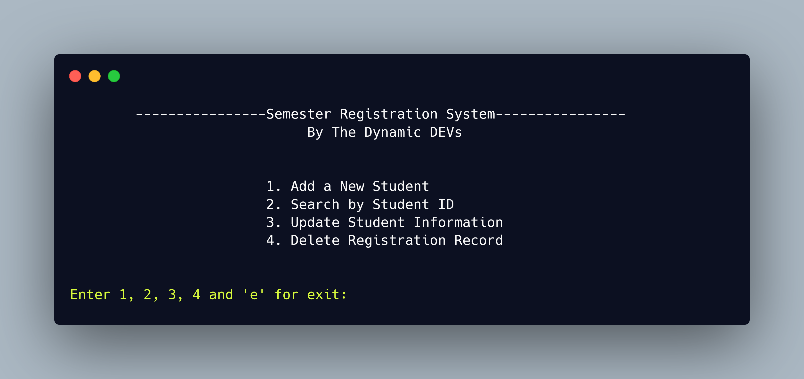

<h1 align="center"><b>Student Registration System</b> By Dynamic DEVs</h1>

Login Interface

## Features
   * User (Teacher) Login and Registration System
   * Add New Student
   * Specific Course and Section Record
   * Search Students by ID
   * Update Student Information
   * Delete Students

All information stored in Database we used SQlite.

Main Menu Interface

## Instructions
1. We have added user ID in our student information table so that a user can easily recognize which students are under control of this user. 
Here, users are mainly teachers. Only advised teachers have access to make any changes of his/her students.
2. A teacher can make changes of any data of a students if the teacher adds him/her in the database.
3. Every time when a user want to make change or do anything in the information, the user have to login at first. 
If He or she has not any account, then he/she can register and create an account and make changes.
4. We have generated an registration ID of a student so that we can use it in our course table.

For Login Information check the [Readme.txt](Readme.txt) file.

## Team
  [Sajal Das](https://github.com/sajaldas19) 
  [Shumaiya Akter Shammi](https://github.com/Shammi179) 
  Tania Afrin Somaya 
  Md Humayun Farid 

## License
Copyright (c) 2020 Sajal Das.